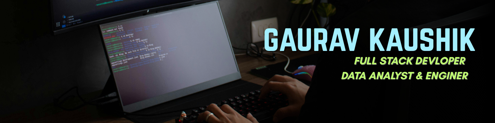

 

 

---

## About Me

I'm Gaurav, a final-year B.Tech Computer Science student and full-stack developer with a strong focus on data engineering and analytics. I work across the full stack — building responsive, production-ready web apps with the MERN stack — while also working on the data side with Python, SQL, and predictive modelling.

I'm actively exploring AI/ML, blockchain, and Web3, and I enjoy mentoring peers as much as I enjoy shipping products. Beyond code, I care about building communities — whether that's running a technical society, organising hackathons, or mentoring open-source contributors.

Open to internships and project-based roles in full-stack development, data analytics, and AI/ML.

---

## Experience

**AI/ML Intern — Coding Blocks** · `June 2026 – Present`
Working on applied AI and machine learning projects in a remote, hands-on internship format.

**Project Admin & Mentor — Social Summer of Code (SSoC 2026)**  · `June 2026 – Present`
Mentoring contributors and managing project direction for MindMitra, an open-source mental health platform, while growing the broader open-source community.

**Project Lead Developer — Municipal Corporation of Delhi (MCD HRMS)** · `April 2026 – July 2026`
Led a team of 15 developers building a full-stack HR Management System (MERN + ML) covering employee records, attendance, leave management, and payroll — under the mentorship of Arvind Yadav. Owned architecture decisions, code reviews, and delivery timelines.

**Vice President — Logic Sync** · `June 2025 – Present`
Lead strategic planning and execution for one of my college's most active technical societies — organising workshops, coding contests, and hackathons, and mentoring juniors on AI, ML, Web3, and UI/UX.

**Joint Secretary — Code Rangers** · `Sept 2024 – Sept 2025`
Coordinated events and communication as part of the club's core leadership team.

**Open Source Contributor — SafeYatri (Social Winter of Code)** · `Dec 2025 – Feb 2026`
Contributed to SafeYatri, a smart tourist safety monitoring system with a blockchain-based digital ID, built on React, TypeScript, Vite, Tailwind, and Supabase.

**Campus Ambassador — GirlScript Summer of Code, LetsUpgrade, Internshala** · `2024 – 2026`
Represented these programs on campus, driving open-source and upskilling participation among students.

---

## Communities

- Microsoft Azure Developer Community
- TechLeads
- GirlScript Summer of Code (GSSoC) — Contributor & Mentor
- Social Summer of Code (SSoC) — Project Admin & Mentor
- Code Rangers — Joint Secretary & Outreach Coordinator

---

## Achievements

**4× Hackathon Winner** — Recognised across multiple competitive hackathons, including felicitation by the CM of Delhi.

**2× Hackathon Organiser** — Planned and ran hackathons end-to-end, from problem statements to judging.

**15× Hackathon Finalist** — Consistently reached the final rounds across a wide range of hackathons.

**2× Microsoft Challenge Winner** — Recognised as a Microsoft Student Partner and challenge winner.

**Mentor & Project Admin, SSoC 2026** — Guiding contributors on MindMitra, an open-source mental health platform.

---

## Connect With Me

---
## Tech Stack

**Languages**

       

**Web & Frontend**

   

**Backend & Cloud**

       

**Databases**

    

**Data Science & AI/ML**

       

**Tools & Platforms**

     

---

## GitHub Analytics

 

<picture>
  <source media="(prefers-color-scheme: dark)" srcset="https://raw.githubusercontent.com/1809gaurav/1809gaurav/output/github-contribution-grid-snake-dark.svg" />
  <source media="(prefers-color-scheme: light)" srcset="https://raw.githubusercontent.com/1809gaurav/1809gaurav/output/github-contribution-grid-snake.svg" />
  
</picture>

---

**From building AI-powered health apps to smart safety systems — always curious, always shipping.**

